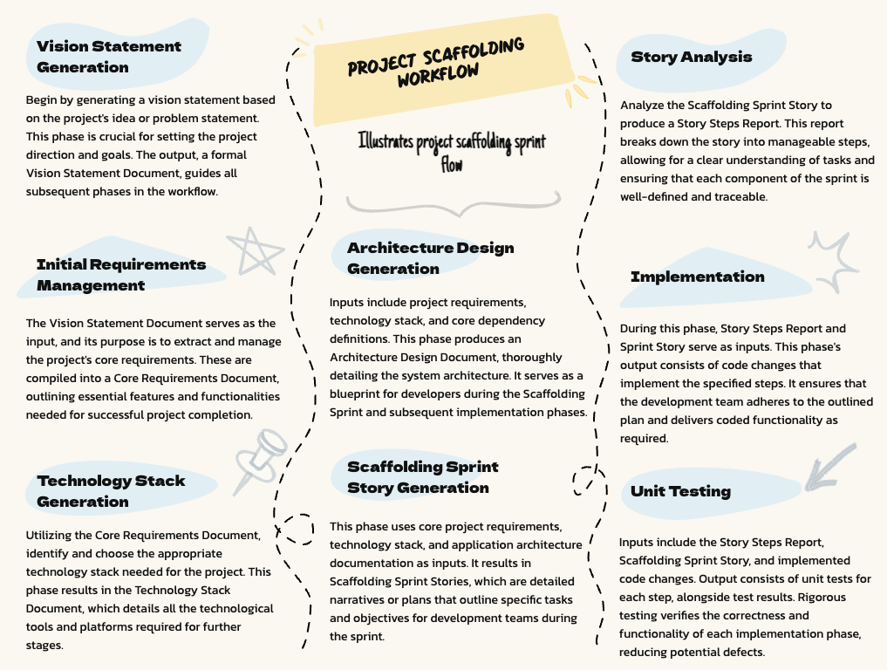

# Project Scaffolding Sprint Workflow Chain: AI-Assisted Planning and Implementation

## Overview

**Note: This workflow is designed for projects that are in the initial scaffolding phase. It assumes no prior project structure, dependencies, or core technologies are in place.**

Below is a visual representation of the workflow (simplified for brevity). Each phase has an associated prompt to guide the developer through that phase.



This workflow represents a chained sequence of AI-assisted processes for planning and implementing the initial project scaffolding. Each phase produces specific outputs that become required inputs for subsequent phases, creating a connected chain of development activities.

The workflow operates through the following sequential phases:

```
Phase 1: Vision Statement Generation
↓ [Outputs feed Phase 2]
Phase 2: Initial Project Requirements Management
↓ [Outputs feed Phase 3]
Phase 3: Technology Stack Generation
↓ [Outputs feed Phase 4]
Phase 4: Architecture Design Generation
↓ [Outputs feed Phase 5]
Phase 5: Scaffolding Sprint Story Generation
↓ [Outputs feed Phase 6]
Phase 6: Story Analysis
↓ [Outputs feed Phase 7A]
Phase 7A: Implementation
↓ [Outputs feed Phase 7B]
Phase 7B: Unit Testing
```

## Input/Output Chain

### Phase 1: Vision Statement Generation (`#generate-vision`)

[Vision Statement Generation Prompt](phase_1-generate-vision.md)

#### Purpose

Define a comprehensive project vision statement that aligns with project requirements.

**Initial Inputs Required:**

- Project idea or problem statement

**Key Outputs → [Feed into Phase 2]:**

- Vision Statement Document (`project_vision.md`)

### Phase 2: Initial Project Requirements Management (`#generate-requirements`)

[Initial Project Requirements Management Prompt](phase_2-generate-requirements.md)

#### Purpose

Define and document core project requirements based on the vision statement.

**Required Inputs (including Phase 1 outputs):**

- Vision Statement Document

**Key Outputs → [Feed into Phase 3]:**

- Core Requirements Document (`core_requirements.md`)

### Phase 3: Technology Stack Generation (`#generate-stack`)

[Technology Stack Generation Prompt](phase_3-generate-stack.md)

#### Purpose

Define and document a compatible, version-locked technology stack.

**Required Inputs (including Phase 2 outputs):**

- Core Requirements Document

**Key Outputs → [Feed into Phase 4]:**

- Technology Stack Document (`tech_stack.md`)

### Phase 4: Architecture Design Generation (`#generate-architecture`)

[Architecture Design Generator Prompt](phase_4-generate-architecture.md)

#### Purpose

Define core architectural components needed for initial project scaffolding.

**Required Inputs (including Phase 3 outputs):**

- Technology Stack Document

**Key Outputs → [Feed into Phase 5]:**

- Architecture Design Document (`initial_architecture.md`)

### Phase 5: Scaffolding Sprint Story Generation (`#generate-scaffold-stories`)

[Scaffolding Sprint Story Generation Prompt](phase_5-generate-scaffold-stories.md)

#### Purpose

Generate focused user stories for the initial project scaffolding sprint.

**Required Inputs (including Phase 4 outputs):**

- Architecture Design Document

**Key Outputs → [Feed into Phase 6]:**

- Scaffolding Sprint Stories (`sprint_1_stories.md`)

### Phase 6: Story Analysis (`#analyze-story S<X.Y>`)

[Story Analysis Prompt](../shared/analyze-story.md)

#### Purpose

Break down user stories into atomic, implementable functional steps.

**Initial Inputs Required:**

- Scaffolding Sprint Story

**Key Outputs → [Feed into Phase 7A]:**

- Story Steps Report (`S<X.Y>-story-steps.md`)

### Phase 7A: Implementation (`#implement-step S<X.Y> [step-number]`)

[Implementation Prompt](../shared/implement-step.md)

#### Purpose

Systematically implement one specific step from the story analysis.

**Key Outputs → [Feed into Phase 7B]:**

- Code changes implementing the specified step

\*Conditional Prompt:\*\*
During the implementation phase, if the Implementation Prompt determines that new dependencies may be required to implement a user story step, it will prompt the user to execute the Dependency Management Prompt. This ensures that all necessary dependencies are evaluated and approved before proceeding with the implementation.

**Iteration Note:**
Phases 7A and 7B iterate until all steps for a user story have been implemented and unit tested.

### Phase 7B: Unit Testing (`#generate-tests S<X.Y> [step-number]`)

[Unit Test Generation Prompt](../shared/generate-tests.md)

#### Purpose

Generate and verify unit tests for the implemented story step.

**Required Inputs (including Phase 6 outputs):**

- Story Steps Report (`S<X.Y>-story-steps.md`)
- Scaffolding Sprint Story

**Key Outputs:**

- Unit tests for the implemented step
- Test results indicating pass/fail status

## Workflow Chain Execution

### Starting the Chain

1. **Initiate Vision Statement Generation:**

   ```
   #generate-vision
   ```

   - Ensure all Phase 1 inputs are available
   - Wait for complete vision statement before proceeding

2. **Generate Requirements:**

   ```
   #generate-requirements
   ```

   - Must have all Phase 1 outputs available
   - Proceeds only when vision statement is complete

3. **Generate Technology Stack:**

   ```
   #generate-stack
   ```

   - Ensure all Phase 2 outputs are available
   - Wait for stack generation to complete before proceeding

4. **Generate Architecture Design:**

   ```
   #generate-architecture
   ```

   - Ensure all Phase 3 outputs are available
   - Wait for architecture design to complete before proceeding

5. **Generate Scaffolding Stories:**

   ```
   #generate-scaffold-stories
   ```

   - Ensure all Phase 4 outputs are available
   - Wait for story generation to complete before proceeding

6. **Analyze Story:**

   ```
   #analyze-story S<X.Y>
   ```

   - Ensure the specific user story is available in the context
   - Wait for story analysis to complete before proceeding

7. **Implement Stories, step by step:**
   ```
   #implement-step S<X.Y> [step-number]
   ```
   - Requires complete story analysis outputs
   - Execute for each story and step, in sequence

### Progress Tracking

Monitor chain progress using status commands:

```
#vision-status
#requirements-status
#stack-status
#architecture-status
#scaffold-stories-status
#analysis-status
#implementation-status
```

### Chain Dependencies

```
Vision Statement Generation
└── Outputs required for Requirements Management:
    ├── Vision Statement Document
    └── Requirements Management
        └── Outputs required for Technology Stack Generation:
            ├── Core Requirements Document
            └── Technology Stack Generation
                └── Outputs required for Architecture Design:
                    ├── Technology Stack Document
                    └── Architecture Design
                        └── Outputs required for Scaffolding Story Generation:
                            ├── Architecture Design Document
                            └── Scaffolding Story Generation
                                └── Outputs required for Story Analysis:
                                    ├── Scaffolding Sprint Stories
                                    └── Story Analysis
                                        └── Outputs required for Implementation:
                                            ├── Story Steps Report
                                            ├── Scaffolding Sprint Story
                                            └── Implementation
                                                └── Outputs required for Unit Testing:
                                                    ├── Code changes implementing the specified step
                                                    └── Unit Testing
```

## Maintaining Chain Integrity

### Verification Points

Each phase has specific verification points where the chain integrity must be confirmed:

1. **Vision → Requirements**

   - Verify vision statement is complete

2. **Requirements → Technology Stack**

   - Verify all requirements are documented

3. **Technology Stack → Architecture Design**

   - Verify technology stack is complete

4. **Architecture Design → Scaffolding Stories**

   - Verify architecture design is complete

5. **Scaffolding Stories → Story Analysis**

   - Verify all stories have required components

6. **Story Analysis → Implementation**
   - Verify story steps report is complete

### Chain Break Prevention

To maintain workflow integrity:

1. Never skip phases or assume outputs
2. Verify all outputs before proceeding to next phase
3. Keep all documentation updated as you progress
4. Use status commands to confirm current state
5. Don't proceed if required inputs are missing

## Best Practices for Chain Execution

1. **Document Management**

   - Keep all phase outputs in accessible locations
   - Document any modifications to outputs
   - Version control all artifacts

2. **Phase Transitions**

   - Explicitly verify all required outputs exist
   - Validate output quality before proceeding
   - Document any assumptions or decisions

3. **Dependency Handling**
   - Track both technical and workflow dependencies
   - Verify dependency satisfaction at each step
   - Document any dependency changes

## Using the Workflow Chain

1. **Preparation**

   - Gather all initial inputs
   - Verify input completeness
   - Set up documentation structure

2. **Execution**

   - Follow the chain sequence strictly
   - Verify outputs at each step
   - Maintain documentation of progress

3. **Verification**
   - Use status commands frequently
   - Verify chain integrity at each phase
   - Document completion of each phase

## AI Integration Notes

This workflow chain has been tested with different LLMs:

- AI Assistant: aider
- Implementation Prompt: Claude 3.5 Sonnet (October 22, 2024 release)
- Other Workflow Prompts: Claude 3.5 Haiku (October 22, 2024 release)

The chain assumes:

- AI can handle file operations
- Developer verifies all outputs
- Each phase completes fully before chain proceeds

## Chain Verification

Before starting each phase, verify:

1. All required inputs are available
2. Previous phase outputs are complete
3. All dependencies are satisfied
4. Documentation is current

Remember: The strength of this workflow lies in its chained nature. Each phase builds upon the outputs of the previous phase, creating a comprehensive and connected development process.
